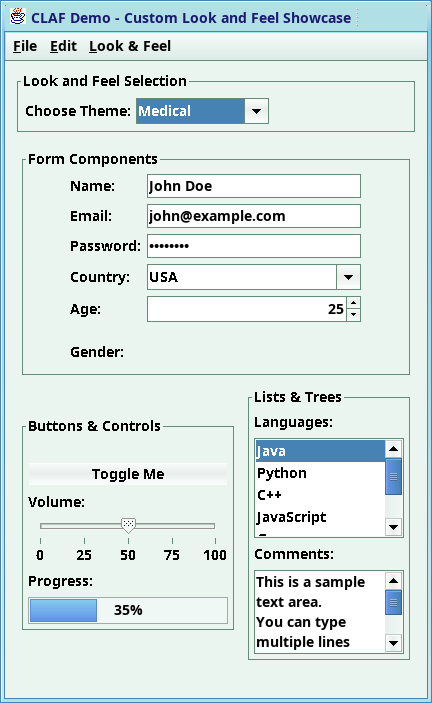
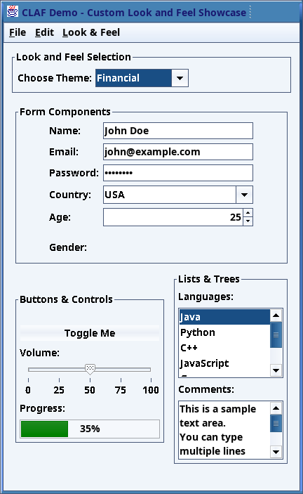
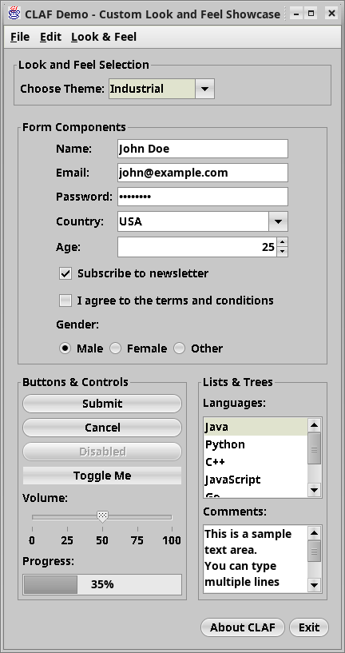

# CLAF - Custom Look and Feel

A modern Java Swing Look and Feel library

## Overview

CLAF provides custom Look and Feel implementations for Java Swing applications, offering several themes:

## Requirements

- **Java 17+** (originally required Java 1.4)
- **Maven 3.6+** for building

### Using Maven

Add this dependency to your `pom.xml`:

```xml
<dependency>
    <groupId>com.cfhayes.claf</groupId>
    <artifactId>claf</artifactId>
    <version>2.0.0</version>
</dependency>
```

### Building from Source

```bash
git clone https://github.com/yourusername/claf.git
cd claf
./mvnw clean install
```

## Usage

### Quick Demo

./mvnw exec:java
```

### Basic Usage

```java
import com.cfhayes.claf.industrial.IndustrialLookAndFeel;
import javax.swing.UIManager;

public class MyApp {
    public static void main(String[] args) {
        try {
            // Choose your theme
            UIManager.setLookAndFeel(new IndustrialLookAndFeel());
        } catch (Exception e) {
            e.printStackTrace();
        }
        
        // Create your Swing application
        SwingUtilities.invokeLater(() -> {
            new MyFrame().setVisible(true);
        });
    }
}
```

### Theme Configuration

You can customize themes using properties:

```java
import com.cfhayes.claf.industrial.IndustrialLookAndFeel;
import java.util.Properties;

Properties props = new Properties();
props.setProperty("controlTextFont", "Dialog 14");
props.setProperty("windowDecoration", "on");
props.setProperty("textAntiAliasing", "on");

IndustrialLookAndFeel.setTheme(props);
```

### Available Themes

<table>
  <tr>
    <td><b>Healthcare Theme</b></td>
    <td><b>Financial Theme</b></td>
    <td><b>Industrial Theme</b></td>
  </tr>
  <tr>
    <td></td>
    <td></td>
    <td></td>
  </tr>
</table>

## Contributing

1. Fork the repository
2. Create a feature branch (`git checkout -b feature/amazing-feature`)
3. Make your changes
4. Add tests for new functionality
5. Commit your changes (`git commit -m 'Add amazing feature'`)
6. Push to the branch (`git push origin feature/amazing-feature`)
7. Open a Pull Request

## Testing

Run tests with:

```bash
./mvnw test
```

## License

